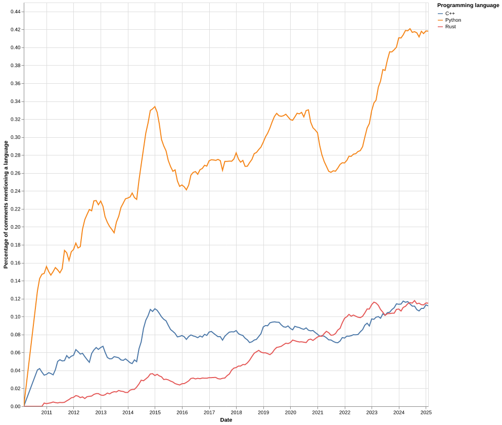

# Programming language trends in Hacker News job posts

Following on a nerd-snipe: https://news.ycombinator.com/item?id=43111615.

## Usage
1. `uv run scrape.py >> scraped.ndjson` will scrape the necessary data into `scraped.ndjson` using Algolia's [HN Search API](https://hn.algolia.com/api).
2. `uv run analyze.py` will write `chart.png`.

## Scraped data model
Columns:
- Story ID
- Story title
- Story author
- Comment ID
- Comment author
- Comment text
